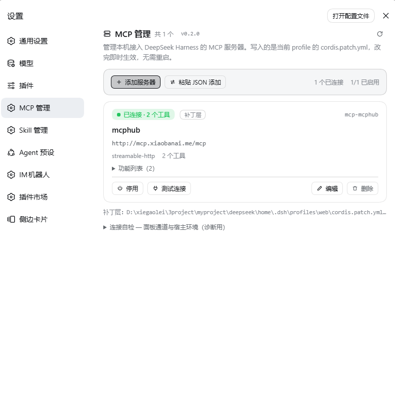
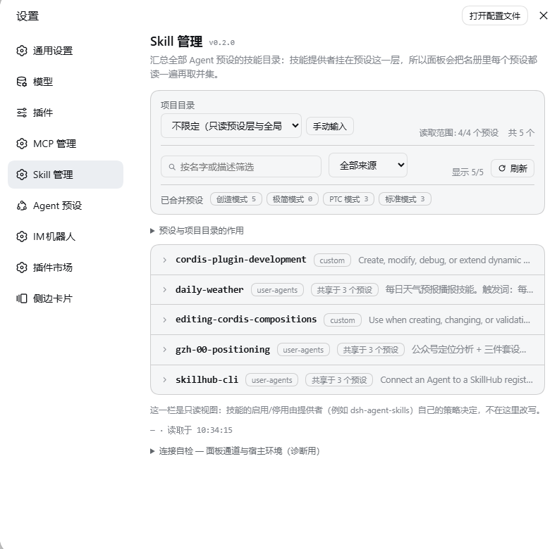

# dsh-mcp-skill-panel

一个 DSH（DeepSeek Harness）面板插件：在 **设置** 左侧菜单里加两项 —— **MCP 管理** 和 **Skill 管理**。

- **MCP 管理**：列出这台 harness 上正在跑的 MCP 服务器，也包含补丁层里刚写、宿主还没重组的行。
  可以新增（表单填写，或直接粘贴 Claude / VS Code / `cordis.patch.yml` 形态的配置）、编辑、
  启用 / 停用、删除、**测试连接**，并按需展开每台服务器注册给模型的**功能列表**。
- **Skill 管理**：把**全部 Agent 预设**的技能目录合并成一份名册，支持搜索、按来源过滤、
  按项目目录查看项目级技能、两级展开看正文预览。这一栏是**只读**的 —— 启用 / 停用属于 provider
  层策略，本插件不去改写别的插件。

它只改一处东西：**当前 profile 的 `cordis.patch.yml`**，也就是 harness 自己的补丁层，而不是插件
私有的状态文件。所以你自己手写的行、别的工具留下的行、面板新建的行，在面板里一样**能改、能停、
能删**；profile 开了 `patchReload: live` 时**写入即生效**。

> 宿主形态：宿主半部是 **类插件**（`Service` 子类，对外提供 `ctx.mcpSkillPanel`）；
> 浏览器半部是 **函数插件**（只注册槽位，不提供 service）。
> 安装形态：**Bundle 插件**（`dsh plugin --profile web add`，装完需重启一次 `dsh web`）。
> 版本 **0.2.0**。

## 界面

两个页面都是 **设置** 左侧菜单里的一项，点开即用：

| MCP 管理 | Skill 管理 |
| :---: | :---: |
|  |  |

## 安装

**前置**：一份能跑 `dsh web` 的 DeepSeek Harness。在 harness 检出目录里执行：

```sh
# 从 GitHub 产物仓装（仓库里就是构建好的产物，安装时不构建）
pnpm dsh plugin --profile web add "github:hardai520/dsh-mcp-skill-panel#v0.2.0"
```
然后**重启 `dsh web`**
装好后进 **设置**，左侧菜单会多出 **MCP 管理** 和 **Skill 管理** 两项。

### 卸载 / 升级
```sh
pnpm dsh plugin --profile web remove dsh-mcp-skill-panel   # 清单里的 bundle 行会一起消失
pnpm dsh plugin --profile web update dsh-mcp-skill-panel   # 升级后同样要重启 dsh web
```
## 常见问题

**装完 / 升级后页面没变，或提示 `unknown endpoint mcp.tools`、「功能列表读取失败」**

宿主半部只在 `dsh web` 启动时加载一次，浏览器半部每次刷新都取最新 —— 所以**只刷新页面不够**，
重启 `dsh web` 就好。面板自己也会在页面上提示这一点。

**左侧菜单里没有「MCP 管理 / Skill 管理」**

1. 确认装上了：`pnpm dsh web --dump-config | Select-String mcp-skill-panel`；
2. 确认重启过 `dsh web`；
3. 还是看不到就看浏览器控制台，多半是浏览器半部没加载上。

## 许可

MIT
